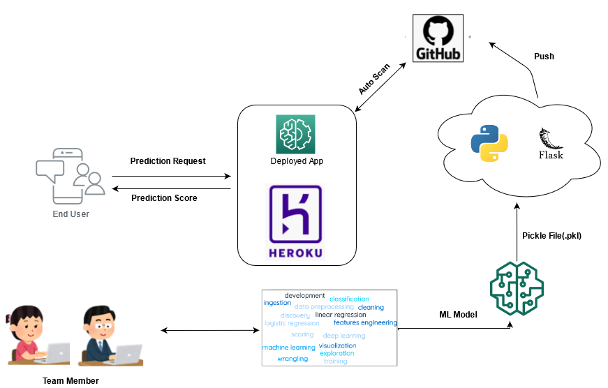

# CO2 Emission by Cars
A reliable End to End Machine Learning Model to predict CO2 Emissions in different type of Cars. 

### Description

The task is to build a machine learning model to predict CO2 emissions by different types of cars based on features such as:

* Model of car
* Engine Size (in Litre)
* Number of cylinders
* Class of vehicle
* Fuel consumption (on highways, in city roads)

Project also aims at testing the influence of different independent features on the emission of CO2 using statistical methods. 


### DataSet:

* The dataset has been taken from the Canada Government official open data website and is available in [kaggle](https://www.kaggle.com/datasets/debajyotipodder/co2-emission-by-vehicles)
* Cleaned and processed version of the data can be accessed from [here](https://raw.githubusercontent.com/d0r1h/CO2-Emission-by-Cars/main/final_co2.csv)
* Dataset contains 7385 datapoints and 12 columns.


### Notebook:

Notebook contains the EDA, data processing, and model building ideas. 

| Notebook | Colab | Kaggle |
| ------ | ------ | ------ |
| CO2 Emission | [](https://colab.research.google.com/github/d0r1h/CO2-Emission-by-Cars/blob/main/notebook/co2-emission-by-cars.ipynb) | [](https://www.kaggle.com/code/undersc0re/co2-emission-by-cars) |

### Models
We experimented with different methods for model building 

* OLS Regression
* Ridge Regression
* Lasso Regression	
* Elastic Net Regression	

## Project Pipeline




### Techstack

**Python version** : 3.7 <br>
**Packages**: pandas, numpy, seaborn, sklearn, mlxtend, statsmodels <br>
**Cloud**: heroku

### Usage [running locally]:

```python
conda create -n envname python=3.7
activate envname
git clone https://github.com/d0r1h/CO2-Emission-by-Cars.git
cd CO2-Emission-by-Cars
pip install -r requirements.txt
python app.py
```

## Results 


* Ridge Regression (with alpha = 0.5) has been the most effective in reducing RMSE.
* The exact combination of features responsible for high CO2 emissions cannot be predicted Since all the features are highly correlated.
* Following image shows score table for different models


 


### Inference Demo:

Application is deployed on heroku and can be accessed at https://coemission.herokuapp.com/ and following data can be used to test the application. 

|Engine Size|Cylinders|Fuel Consumption City|Fuel Consumption Hwy|Fuel Consumption Comb| Fuel Consumption Comb (mpg) | Fuel Types | Transmission type | Make | Vechicle Class | CO2 Emissions | 
| ------------- | ------------- | -------- | -------- |-------- |------- |------- | ------ | ------- | ------- | ------- |
| 3.5   | 6 | 11.9  | 7.7 | 10 | 28 | z | AS6 | Luxury | Sedan | 230 |
| 3.5 | 6 | 11.8  | 8.1 | 10.1 | 28 | z | AS6 | Luxury | Sedan | 232 |
