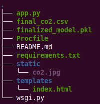

# CO2 Emission by Cars
A reliable End to End Machine Learning Model to predict CO2 Emissions in different type of Cars. 

## Infrastructure

## File Structure 

## Acknowledgment

## Usage

* <b>Running in local Server</b>

	1. Create a new virtual environment using conda command 
	
		    conda create -n envname python=3.7
		    
    2. Activate new virtual environment
            activate envname
            
    3. Install Dependency
            pip install -r requirements.txt
            
    4. Start application server
            python app.py
            
    5. Copy url and paste in browser, fill in values and press calculate co2 button.
    
* <b>Running on cloud</b>

